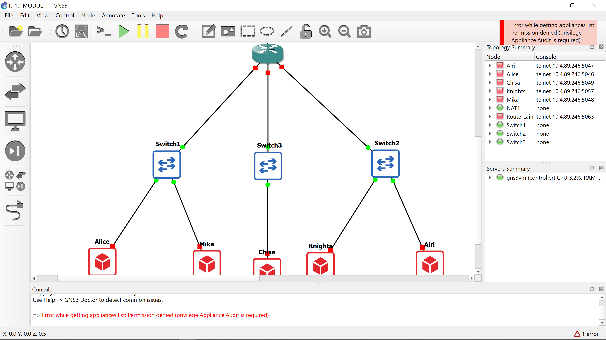
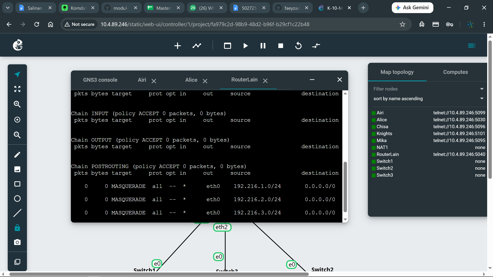
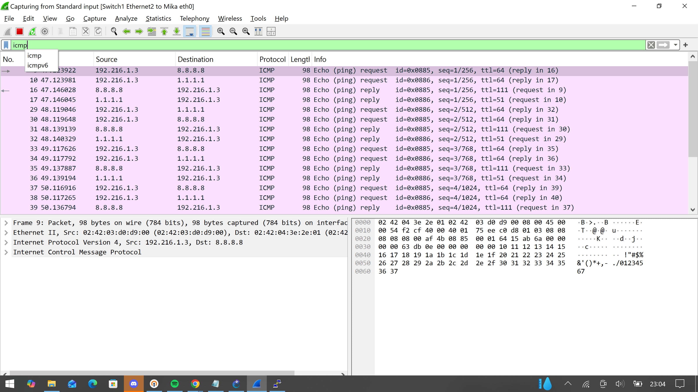
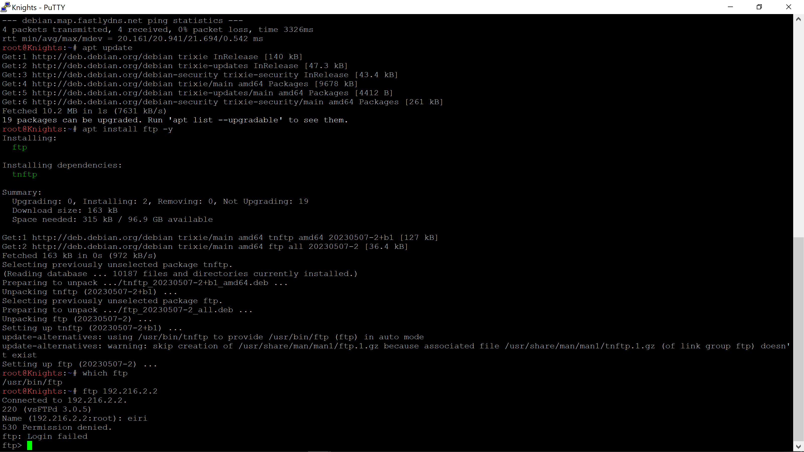
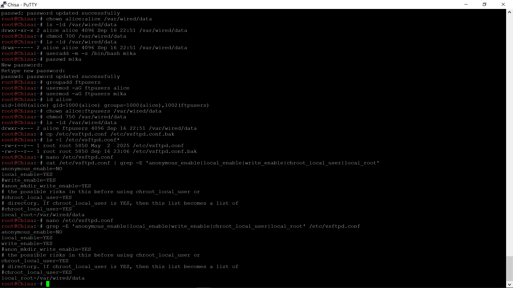
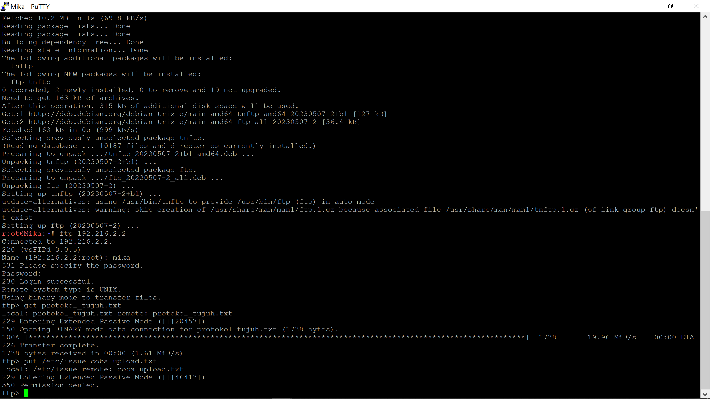

# Laporan Hasil Praktikum Komunikasi Data dan Jaringan Komputer
Praktikum ini menggunakan skenario Serial Experiments Lain sebagai gambaran jaringan komputer yang disebut The Wired. Pada skenario tersebut, Lain Iwakura berperan sebagai router yang bertugas membangun dan menjaga komunikasi antara beberapa entitas dalam jaringan.

Jaringan terdiri dari tiga segmen utama yang dihubungkan oleh Router Lain. Switch 1 menghubungkan Alice dan Mika, Switch 2 menghubungkan Chisa, sedangkan Switch 3 menghubungkan Knights dan Eiri. Router Lain kemudian dikonfigurasikan agar jaringan internal dapat berkomunikasi satu sama lain serta mengakses internet melalui NAT.

Selain konfigurasi jaringan dasar, praktikum juga mencakup konfigurasi DNS, firewall/NAT, mekanisme persistence, analisis traffic menggunakan Wireshark, serta pembangunan FTP Server dengan pembatasan hak akses berdasarkan user.

## Soal 1 (Topologi dan Konfigurasi IP Client)
### Buat topologi jaringan pada GNS3 sesuai pembagian subnet:

  1. Switch 1: Node Alice & Mika
  2. Switch 2: Node Chisa
  3. switch 3: Node Knights & Eiri

<p align="center">
  
</p>

### Setting ip address masing masing client dan routernya
| Node | IP Address | Gateway |
|---|---|---|
| Alice | 192.216.1.2 | 192.216.1.1 |
| Mika | 192.216.1.3 | 192.216.1.1 |
| Chisa | 192.216.2.2 | 192.216.2.1 |
| Knights | 192.216.3.2 | 192.216.3.1 |
| Airi | 192.216.3.3 | 192.216.3.1 |

## Soal 2
### Setting konfigurasi pada Router Lain 
Tujuan dari setting konfigurasi pada Router Lain adalah agar memiliki akses langsung ke jaringan luar melalui `interface eth0.`

Pada Router Lain ketik
```bash
dhclient eth0
```
Kemudian cek 
```bash
ip -br a
```
Cek default route
```bash
ip route
```
Tes koneksi
```bash
ping -c 4 8.8.8.8
```
### Analisis
Interface eth0 digunakan sebagai interface eksternal Router Lain. DHCP digunakan untuk memperoleh konfigurasi jaringan secara otomatis. Keberhasilan ping ke 8.8.8.8 menunjukkan bahwa Router Lain telah memiliki konektivitas ke jaringan internet.

## Soal 3 Routing Antar Client
Aktifkan IP forwarding di Router Lain :
```bash
sysctl -w net.ipv4.ip_forward=1
```
Hasilnya harus menunjukan :
```bash
net.ipv4.ip_forward = 1
```
Karena seluruh subnet terhubung langsung ke Router Lain, routing antarjaringan dapat dilakukan melalui gateway masing-masing client.
### Tes Mengirimkan Paket
kemudian kita mencoba tes ping pada salah satu client disini aku menggunakan contoh Client Alice mengirimpan ping kepada Client Airi
<p align="center">
  
</p>

## Analisis
Keberhasilan komunikasi antar-subnet menunjukkan bahwa Router Lain berhasil menjalankan fungsi routing. Paket dari client akan dikirim ke default gateway terlebih dahulu, kemudian diteruskan oleh Router Lain menuju subnet tujuan.

## Soal 4
Memungkinkan seluruh client pada jaringan internal mengakses internet secara mandiri.
### Mengaktifkan IP Forwarding
pada Router Lain :
```bash
sysctl -w net.ipv4.ip_forward=1
```
### Konfigurasi NAT
```bash
iptables -t nat -A POSTROUTING -s 192.216.1.0/24 -o eth0 -j MASQUERADE
iptables -t nat -A POSTROUTING -s 192.216.2.0/24 -o eth0 -j MASQUERADE
iptables -t nat -A POSTROUTING -s 192.216.3.0/24 -o eth0 -j MASQUERADE
```
### Cek Hasil 
```bash
iptables -t nat -L -v -n
```
<p align="center">
  
</p>

### Konfigurasi DNS pada Setiap Client
Pada setiap client :
```bash
printf 'nameserver 8.8.8.8\nnameserver 1.1.1.1\n' > /etc/resolv.conf
```
Tujuannya adalah agar setiap client bisa terhubung ke internet secara mandiri dan bisa mengakses domain `google.com` dan bisa ping `8.8.8.8`

Tes DNS :
```bash
ping -c 4 google.com
```
<p align="center">
  
</p>

### Analisis
NAT MASQUERADE mengubah alamat sumber dari client private menjadi alamat yang digunakan oleh interface eksternal Router Lain. Dengan demikian, client pada ketiga subnet dapat berkomunikasi dengan internet.

DNS resolver `8.8.8.8` dan `1.1.1.1` digunakan agar client dapat menerjemahkan nama domain seperti `google.com` menjadi alamat IP.

## Soal 5
Memastikan konfigurasi jaringan dan NAT dapat dipulihkan setelah router mengalami restart.
### Menyimpan Konfigurasi IPTables
pada Router Lain :
```bash
iptables-save > /root/iptables.rules
```
Buat script `restore_nat.sh` :
```bash
nano /root/restore_nat.sh
```
Isi dari script `restore_nat.sh` :
```bash
#!/bin/bash

iptables-restore < /root/iptables.rules
```
Buat script `init.sh` :
```bash
nano root/init.sh
```
Isi script `init.sh` :
```bash
#!/bin/sh

sysctl -w net.ipv4.ip_forward=1

if [ -f /root/iptables.rules ]; then
    iptables-restore < /root/iptables.rules
fi
```
Buat script `cek_status.sh` :
```bash
nano root/cek_status.sh
```
Isi script `cek_status.sh` :
```bash
#!/bin/bash

echo "===== INTERFACE ====="
ip -br a

echo
echo "===== NAT TABLE ====="
iptables -t nat -L -v -n
```
Bikin script :
```bash
nano /etc/sysctl.d/99-router.conf
```
Agar tetap aktif setelah dilakukan reboot

Ini untuk menyimpan rule tersebut dari NAT
```bash
iptables-save > /root/iptables.rules
```
Jalankan :
```bash
/root/cek_status.sh
```
<p align="center">
  
</p>

### Analisis
Mekanisme persistence dibuat agar konfigurasi IP forwarding dan aturan NAT dapat dipulihkan ketika router diinisialisasi kembali. Script `cek_status.sh` digunakan untuk melakukan verifikasi terhadap kondisi interface dan tabel NAT.

## Soal 6
Menghasilkan traffic ICMP dan DNS dari Mika kemudian mengidentifikasi paket tersebut menggunakan Wireshark.

Traffic generator yang digunakan menjalankan beberapa `ping`, `nslookup`, dan `dig`.
### Membuat Traffic Generator
Pada console Mika :
```bash
nano /root/traffic_protocol7.sh
```
Ini sebenarnya sudah diberikan filenya oleh para asisten tetapi saya kesusahan untuk memasukkan filenya kedalam console jadinya saya membuat file script di dalam consolenya dan isi dari file yang diberikan oleh para asisten saya copas ke dalam script yang saya bikin.

Isi scriptnya :
```bash
#!/bin/bash

echo "============================================"
echo "  Protocol 7 Traffic Generator v2026"
echo "  Node: Mika Iwakura"
echo "============================================"
echo "[*] Generating DNS & ICMP traffic..."

ping -c 5 8.8.8.8 &
ping -c 5 1.1.1.1 &
ping -c 3 its.ac.id &

nslookup google.com 8.8.8.8 &
nslookup its.ac.id 8.8.8.8 &
nslookup github.com 1.1.1.1 &
dig @8.8.8.8 example.com A &
dig @1.1.1.1 cloudflare.com AAAA &

wait

echo "[*] Traffic generation complete."
echo "[*] Check Wireshark for captured packets."
```
### Captur Wireshark
Mulai capture wireshark pada interface mika. Lakukan filter `icmp` dan `dns`.

Ini untuk filter `ICMP`
<p align="center">
  
</p>

Ini untuk Hasil Filter `DNS`
<p align="center">
  
</p>

### Analisis
Traffic generator berhasil menghasilkan dua jenis traffic utama, yaitu ICMP dan DNS. Pada paket ICMP ditemukan Echo Request yang berasal dari Mika menuju alamat tujuan seperti `1.1.1.1`. Sementara itu, paket DNS menunjukkan adanya proses query terhadap beberapa domain menggunakan resolver `8.8.8.8` dan `1.1.1.1`.

## Soal 7
Membangun FTP Server pada Chisa dan menerapkan hak akses berbeda kepada Alice, Mika, dan Eiri.

| User | Hak akses |
|---|---|
| Alice | Read + Write |
| Mika | Read Only |
| Eiri | Tidak Boleh Login |

### Install vsftpd
Pada Chisa :
```bash
apt update
apt install vsftpd -y
```
### Membuat Folder FTP
```bash
mkdir -p /var/wired/data
```
Buat Group :
```bash
groupadd ftpusers
```
Tambahkan Users :
```bash
usermod -aG ftpusers alice
usermod -aG ftpusers mika
```
Atur Permission nya :
```bash
chown alice:ftpusers /var/wired/data
chmod 750 /var/wired/data
```
### Membuat User
```bash
useradd -m -s /bin/bash alice
passwd alice

useradd -m -s /bin/bash mika
passwd mika

useradd -m -s /bin/bash eiri
passwd eiri
```
### Konfigurasi vsftpd
Backup :
```bash
cp /etc/vsftpd.conf /etc/vsftpd.conf.bak
```
Edit isi dari :
```bash
nano /etc/vsftpd.conf
```
Konfigurasi user :
```bash
anonymous_enable=NO
local_enable=YES
write_enable=YES
chroot_local_user=YES
local_root=/var/wired/data
userlist_enable=YES
userlist_deny=YES
userlist_file=/etc/vsftpd.user_list
allow_writeable_chroot=YES
user_config_dir=/etc/vsftpd_user_conf
```
Buat Eiri agar tidak bisa masuk ke dalam folder tersebut :
```bash
echo "eiri" > /etc/vsftpd.user_list
```
Untuk konfigurasi mika :
```bash
mkdir -p /etc/vsftpd_user_conf
nano /etc/vsftpd_user_conf/mika
```
Isi dengan :
```bash
write_enable=NO
```
### Menjalankan FTP Server
```bash
/usr/sbin/vsftpd /etc/vsftpd.conf &
```
Cek :
```bash
ps aux | grep '[v]sftpd'
```
### Alice Membuat File
```bash
su - alice
echo "Signal dari Alice" > /var/wired/data/signal_alice.txt
ls -l /var/wired/data/signal_alice.txt
```
### Pengujian Eiri
Dari client yang memilik ftp client :
```bash
ftp 192.216.2.2
```
Kemudian masuk sebagai user Eiri :
```bash
Nama : eiri
Password : 12345
```
Kemudian hasil nya ada permission denied
<p align="center">
  
</p>

<p align="center">
  
</p>

<p align="center">
  
</p>

### Analisis
FTP Server pada Chisa berhasil dikonfigurasi dengan tiga tingkat akses. Alice memiliki hak baca dan tulis, Mika hanya dapat membaca data, sedangkan Eiri dimasukkan ke dalam daftar penolakan sehingga tidak dapat melakukan login ke FTP Server.

## Soal 8
Melakukan transfer file dari Knights ke FTP Server Chisa menggunakan akun Alice dan menganalisis komunikasi FTP menggunakan Wireshark.

### Membuat File Upload di Kights
```bash
echo "File upload dari Knights" > upload_knights.txt
ls -l upload_knights.txt
```
### Jalankan Wireshark
Sebelum melakukan FTP, lakukan capture wireshark terlebih dahulu pada nosole knights. Kemudian masuk ke dalam alice user dan mulai upload file knights.txt tadi

### Analisis Wireshark 
Gunakan filter `ftp` kemudian cari perintah FTP untuk upload `(STOR)`, kode status sukses server `(226)`, dan port data TCP yang dinegosiasikan pada mode `PASV`.

<p align="center">
  
</p>

<p align="center">
  
</p>

### Analisis
Proses upload FTP menggunakan command `STOR`. Setelah server menerima dan menyelesaikan transfer file, server memberikan response code `226 Transfer complete`. Pada passive mode, server memberikan informasi port yang digunakan untuk koneksi data sehingga proses transfer dapat berlangsung melalui koneksi data FTP terpisah dari koneksi kontrol.

## Soal 9
Menguji hak akses Mika sebagai user FTP yang hanya memiliki permission read-only.
### Dokumen protokol_7
Masukkan dokumen `protokol_7` di dalam console chisa, kemudian pindah ke console mika dan masuk sebagai user mika
```bash
ftp 192.216.2.2
Nama : mika
Password : 12345
ls
```
### Download Dokumen
Setelah masuk ke user mika, lakukan uji Download (membaca) file `protokol_tujuh.txt`
```bash
get protokol_tujuh.txt
```
### Membuktikan Mika Tidak Bisa Upload File
```bash
put /etc/issue/coba_upload.txt
```
<p align="center">
  
</p>

### Analisis
Mika berhasil melakukan operasi download karena akun tersebut memiliki hak akses read-only. Namun ketika Mika mencoba mengunggah file, server menolak operasi tersebut dan memberikan response `550 Permission denied`. Hal ini membuktikan bahwa pembatasan write pada akun Mika telah berhasil diterapkan.

## Soal 10
Mengukur performa koneksi antara Knights dan Chisa menggunakan ICMP dengan:

  1. Payload: 128 bytes
  2. Interval: 0,3 detik
  3. Jumlah paket: 77

### Capture Wireshark
jalankan paket capture lewat kabel chisa dan switch, kemudian kirim paket dari console knights ke chisa
<p align="center">
  
</p>

### Gunakan Filter Wireshark
Gunakan filter `ICMP`, kemudian hasilnya akan ketemu yaitu berapa persen packet loss dan RTT.

<p align="center">
  
</p>

### Analisis
  1. Hasil `0%` packet loss membuktikan bahwa jalur routing antar-subnet dari node Knights ke node Chisa beroperasi secara optimal tanpa adanya packet dropping.  
  2. Nilai RTT yang terukur pada kisaran sub-milidetik `($\approx 0.23$–$0.30\text{ ms}$)` mengindikasikan latensi jaringan yang sangat rendah pada arsitektur The Wired.  