# Jarkom-Modul-1-2026-K-10

## Identitas Praktikan

| Nama                     | NRP        | Kelas |
| ------------------------ | ---------- | ----- |
| Putu Putra Sakti Sadhana | 5027251101 | B     |
| Danish Faeyza Rusmawan   | 5027251028 | B     |
## Reporting

Praktikum ini menggunakan skenario Serial Experiments Lain sebagai gambaran jaringan komputer yang disebut The Wired. Pada skenario tersebut, Lain Iwakura berperan sebagai router yang bertugas membangun dan menjaga komunikasi antara beberapa entitas dalam jaringan.

Jaringan terdiri dari tiga segmen utama yang dihubungkan oleh Router Lain. Switch 1 menghubungkan Alice dan Mika, Switch 2 menghubungkan Chisa, sedangkan Switch 3 menghubungkan Knights dan Eiri. Router Lain kemudian dikonfigurasikan agar jaringan internal dapat berkomunikasi satu sama lain serta mengakses internet melalui NAT.

Selain konfigurasi jaringan dasar, praktikum juga mencakup konfigurasi DNS, firewall/NAT, mekanisme persistence, analisis traffic menggunakan Wireshark, serta pembangunan FTP Server dengan pembatasan hak akses berdasarkan user.
## Soal 1 (Topologi dan Konfigurasi IP Client)
### Buat topologi jaringan pada GNS3 sesuai pembagian subnet:

  1. Switch 1: Node Alice & Mika
  2. Switch 2: Node Chisa
  3. switch 3: Node Knights & Eiri

<p align="center">
  
</p>

### Setting ip address masing masing client dan routernya
| Node | IP Address | Gateway |
|---|---|---|
| Alice | 192.216.1.2 | 192.216.1.1 |
| Mika | 192.216.1.3 | 192.216.1.1 |
| Chisa | 192.216.2.2 | 192.216.2.1 |
| Knights | 192.216.3.2 | 192.216.3.1 |
| Airi | 192.216.3.3 | 192.216.3.1 |

## Soal 2
### Setting konfigurasi pada Router Lain 
Tujuan dari setting konfigurasi pada Router Lain adalah agar memiliki akses langsung ke jaringan luar melalui `interface eth0.`

Pada Router Lain ketik
```bash
dhclient eth0
```
Kemudian cek 
```bash
ip -br a
```
Cek default route
```bash
ip route
```
Tes koneksi
```bash
ping -c 4 8.8.8.8
```
### Analisis
Interface eth0 digunakan sebagai interface eksternal Router Lain. DHCP digunakan untuk memperoleh konfigurasi jaringan secara otomatis. Keberhasilan ping ke 8.8.8.8 menunjukkan bahwa Router Lain telah memiliki konektivitas ke jaringan internet.

## Soal 3 Routing Antar Client
Aktifkan IP forwarding di Router Lain :
```bash
sysctl -w net.ipv4.ip_forward=1
```
Hasilnya harus menunjukan :
```bash
net.ipv4.ip_forward = 1
```
Karena seluruh subnet terhubung langsung ke Router Lain, routing antarjaringan dapat dilakukan melalui gateway masing-masing client.
### Tes Mengirimkan Paket
kemudian kita mencoba tes ping pada salah satu client disini aku menggunakan contoh Client Alice mengirimpan ping kepada Client Airi
<p align="center">
  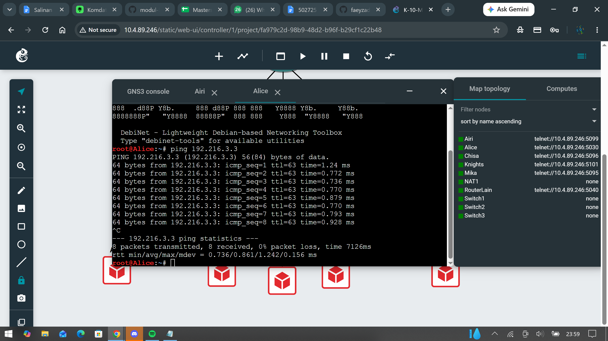
</p>

## Analisis
Keberhasilan komunikasi antar-subnet menunjukkan bahwa Router Lain berhasil menjalankan fungsi routing. Paket dari client akan dikirim ke default gateway terlebih dahulu, kemudian diteruskan oleh Router Lain menuju subnet tujuan.

## Soal 4
Memungkinkan seluruh client pada jaringan internal mengakses internet secara mandiri.
### Mengaktifkan IP Forwarding
pada Router Lain :
```bash
sysctl -w net.ipv4.ip_forward=1
```
### Konfigurasi NAT
```bash
iptables -t nat -A POSTROUTING -s 192.216.1.0/24 -o eth0 -j MASQUERADE
iptables -t nat -A POSTROUTING -s 192.216.2.0/24 -o eth0 -j MASQUERADE
iptables -t nat -A POSTROUTING -s 192.216.3.0/24 -o eth0 -j MASQUERADE
```
### Cek Hasil 
```bash
iptables -t nat -L -v -n
```
<p align="center">
  
</p>

### Konfigurasi DNS pada Setiap Client
Pada setiap client :
```bash
printf 'nameserver 8.8.8.8\nnameserver 1.1.1.1\n' > /etc/resolv.conf
```
Tujuannya adalah agar setiap client bisa terhubung ke internet secara mandiri dan bisa mengakses domain `google.com` dan bisa ping `8.8.8.8`

Tes DNS :
```bash
ping -c 4 google.com
```
<p align="center">
  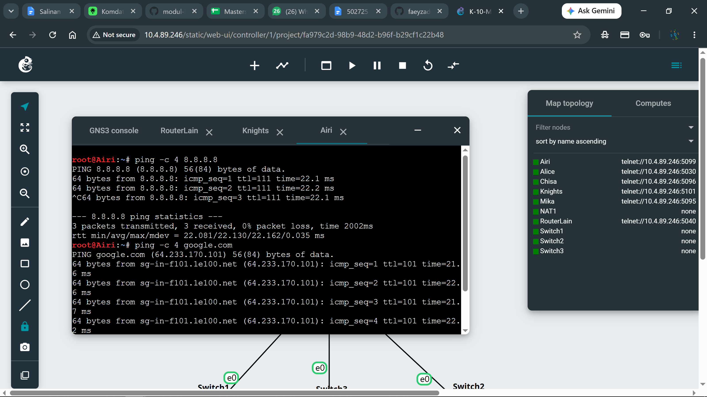
</p>

### Analisis
NAT MASQUERADE mengubah alamat sumber dari client private menjadi alamat yang digunakan oleh interface eksternal Router Lain. Dengan demikian, client pada ketiga subnet dapat berkomunikasi dengan internet.

DNS resolver `8.8.8.8` dan `1.1.1.1` digunakan agar client dapat menerjemahkan nama domain seperti `google.com` menjadi alamat IP.

## Soal 5
Memastikan konfigurasi jaringan dan NAT dapat dipulihkan setelah router mengalami restart.
### Menyimpan Konfigurasi IPTables
pada Router Lain :
```bash
iptables-save > /root/iptables.rules
```
Buat script `restore_nat.sh` :
```bash
nano /root/restore_nat.sh
```
Isi dari script `restore_nat.sh` :
```bash
#!/bin/bash

iptables-restore < /root/iptables.rules
```
Buat script `init.sh` :
```bash
nano root/init.sh
```
Isi script `init.sh` :
```bash
#!/bin/sh

sysctl -w net.ipv4.ip_forward=1

if [ -f /root/iptables.rules ]; then
    iptables-restore < /root/iptables.rules
fi
```
Buat script `cek_status.sh` :
```bash
nano root/cek_status.sh
```
Isi script `cek_status.sh` :
```bash
#!/bin/bash

echo "===== INTERFACE ====="
ip -br a

echo
echo "===== NAT TABLE ====="
iptables -t nat -L -v -n
```
Bikin script :
```bash
nano /etc/sysctl.d/99-router.conf
```
Agar tetap aktif setelah dilakukan reboot

Ini untuk menyimpan rule tersebut dari NAT
```bash
iptables-save > /root/iptables.rules
```
Jalankan :
```bash
/root/cek_status.sh
```
<p align="center">
  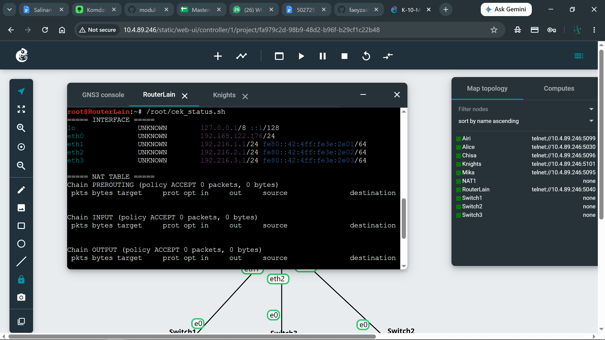
</p>

### Analisis
Mekanisme persistence dibuat agar konfigurasi IP forwarding dan aturan NAT dapat dipulihkan ketika router diinisialisasi kembali. Script `cek_status.sh` digunakan untuk melakukan verifikasi terhadap kondisi interface dan tabel NAT.

## Soal 6
Menghasilkan traffic ICMP dan DNS dari Mika kemudian mengidentifikasi paket tersebut menggunakan Wireshark.

Traffic generator yang digunakan menjalankan beberapa `ping`, `nslookup`, dan `dig`.
### Membuat Traffic Generator
Pada console Mika :
```bash
nano /root/traffic_protocol7.sh
```
Ini sebenarnya sudah diberikan filenya oleh para asisten tetapi saya kesusahan untuk memasukkan filenya kedalam console jadinya saya membuat file script di dalam consolenya dan isi dari file yang diberikan oleh para asisten saya copas ke dalam script yang saya bikin.

Isi scriptnya :
```bash
#!/bin/bash

echo "============================================"
echo "  Protocol 7 Traffic Generator v2026"
echo "  Node: Mika Iwakura"
echo "============================================"
echo "[*] Generating DNS & ICMP traffic..."

ping -c 5 8.8.8.8 &
ping -c 5 1.1.1.1 &
ping -c 3 its.ac.id &

nslookup google.com 8.8.8.8 &
nslookup its.ac.id 8.8.8.8 &
nslookup github.com 1.1.1.1 &
dig @8.8.8.8 example.com A &
dig @1.1.1.1 cloudflare.com AAAA &

wait

echo "[*] Traffic generation complete."
echo "[*] Check Wireshark for captured packets."
```
### Captur Wireshark
Mulai capture wireshark pada interface mika. Lakukan filter `icmp` dan `dns`.

Ini untuk filter `ICMP`
<p align="center">
  
</p>

Ini untuk Hasil Filter `DNS`
<p align="center">
  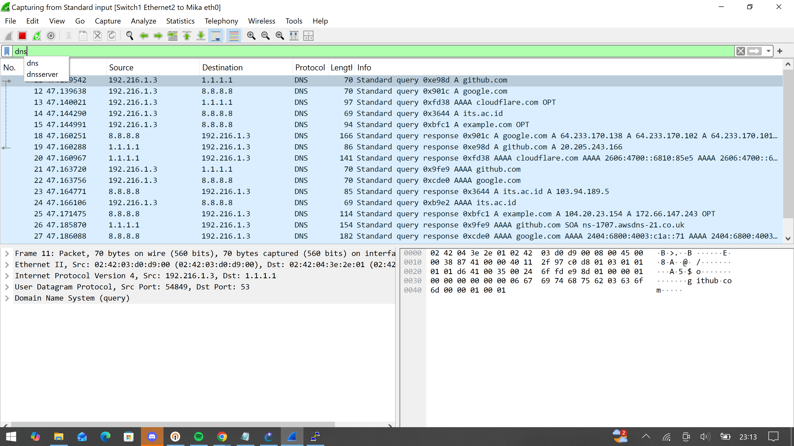
</p>

### Analisis
Traffic generator berhasil menghasilkan dua jenis traffic utama, yaitu ICMP dan DNS. Pada paket ICMP ditemukan Echo Request yang berasal dari Mika menuju alamat tujuan seperti `1.1.1.1`. Sementara itu, paket DNS menunjukkan adanya proses query terhadap beberapa domain menggunakan resolver `8.8.8.8` dan `1.1.1.1`.

## Soal 7

Membangun FTP Server pada Chisa dan menerapkan hak akses berbeda kepada Alice, Mika, dan Eiri.

| User | Hak akses |
|---|---|
| Alice | Read + Write |
| Mika | Read Only |
| Eiri | Tidak Boleh Login |

### Install vsftpd

Pada Chisa :

```bash
apt update
apt install vsftpd -y
```
### Membuat Folder FTP

```bash
mkdir -p /var/wired/data
```

Buat Group :

```bash
groupadd ftpusers
```

Tambahkan Users :

```bash
usermod -aG ftpusers alice
usermod -aG ftpusers mika
```

Atur Permission nya :

```bash
chown alice:ftpusers /var/wired/data
chmod 750 /var/wired/data
```
### Membuat User

```bash
useradd -m -s /bin/bash alice
passwd alice

useradd -m -s /bin/bash mika
passwd mika

useradd -m -s /bin/bash eiri
passwd eiri
```
### Konfigurasi vsftpd

Backup :

```bash
cp /etc/vsftpd.conf /etc/vsftpd.conf.bak
```

Edit isi dari :

```bash
nano /etc/vsftpd.conf
```

Konfigurasi user :

```bash
anonymous_enable=NO
local_enable=YES
write_enable=YES
chroot_local_user=YES
local_root=/var/wired/data
userlist_enable=YES
userlist_deny=YES
userlist_file=/etc/vsftpd.user_list
allow_writeable_chroot=YES
user_config_dir=/etc/vsftpd_user_conf
```

Buat Eiri agar tidak bisa masuk ke dalam folder tersebut :

```bash
echo "eiri" > /etc/vsftpd.user_list
```

Untuk konfigurasi mika :

```bash
mkdir -p /etc/vsftpd_user_conf
nano /etc/vsftpd_user_conf/mika
```

Isi dengan :

```bash
write_enable=NO
```
### Menjalankan FTP Server

```bash
/usr/sbin/vsftpd /etc/vsftpd.conf &
```

Cek :

```bash
ps aux | grep '[v]sftpd'
```
### Alice Membuat File

```bash
su - alice
echo "Signal dari Alice" > /var/wired/data/signal_alice.txt
ls -l /var/wired/data/signal_alice.txt
```
### Pengujian Eiri

Dari client yang memilik ftp client :

```bash
ftp 192.216.2.2
```

Kemudian masuk sebagai user Eiri :

```bash
Nama : eiri
Password : 12345
```

Kemudian hasil nya ada permission denied

<p align="center">
  
</p>

<p align="center">
  
</p>

<p align="center">
  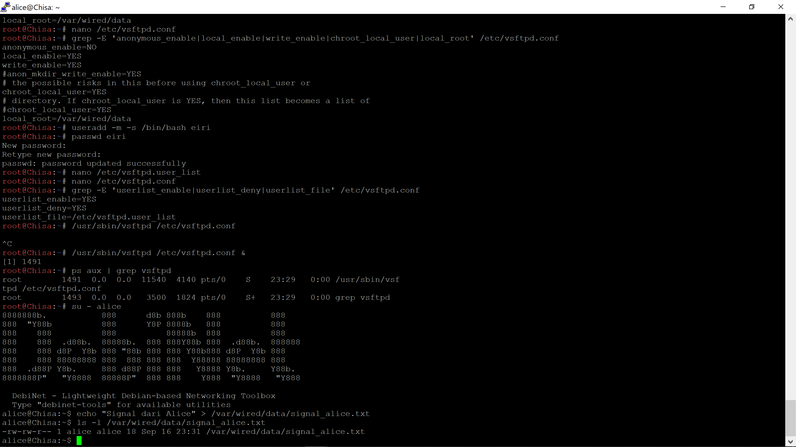
</p>

### Analisis

FTP Server pada Chisa berhasil dikonfigurasi dengan tiga tingkat akses. Alice memiliki hak baca dan tulis, Mika hanya dapat membaca data, sedangkan Eiri dimasukkan ke dalam daftar penolakan sehingga tidak dapat melakukan login ke FTP Server.

## Soal 8

Melakukan transfer file dari Knights ke FTP Server Chisa menggunakan akun Alice dan menganalisis komunikasi FTP menggunakan Wireshark.

### Membuat File Upload di Kights

```bash
echo "File upload dari Knights" > upload_knights.txt
ls -l upload_knights.txt
```
### Jalankan Wireshark

Sebelum melakukan FTP, lakukan capture wireshark terlebih dahulu pada nosole knights. Kemudian masuk ke dalam alice user dan mulai upload file knights.txt tadi

### Analisis Wireshark 

Gunakan filter `ftp` kemudian cari perintah FTP untuk upload `(STOR)`, kode status sukses server `(226)`, dan port data TCP yang dinegosiasikan pada mode `PASV`.

<p align="center">
  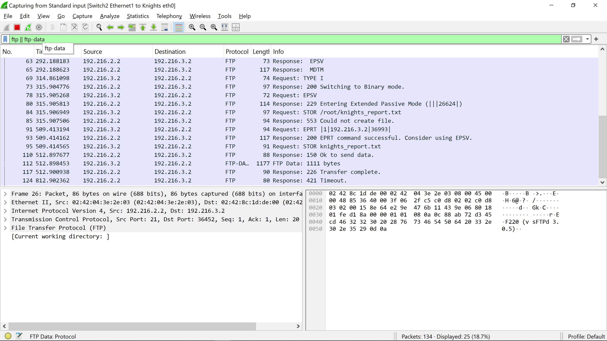
</p>

<p align="center">
  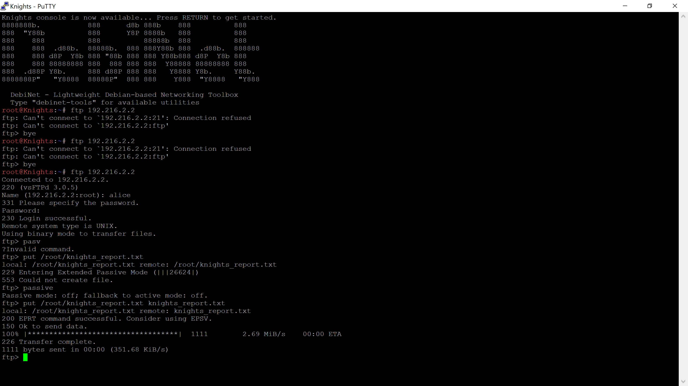
</p>

### Analisis

Proses upload FTP menggunakan command `STOR`. Setelah server menerima dan menyelesaikan transfer file, server memberikan response code `226 Transfer complete`. Pada passive mode, server memberikan informasi port yang digunakan untuk koneksi data sehingga proses transfer dapat berlangsung melalui koneksi data FTP terpisah dari koneksi kontrol.

## Soal 9

Menguji hak akses Mika sebagai user FTP yang hanya memiliki permission read-only.
### Dokumen protokol_7

Masukkan dokumen `protokol_7` di dalam console chisa, kemudian pindah ke console mika dan masuk sebagai user mika

```bash
ftp 192.216.2.2
Nama : mika
Password : 12345
ls
```
### Download Dokumen

Setelah masuk ke user mika, lakukan uji Download (membaca) file `protokol_tujuh.txt`

```bash
get protokol_tujuh.txt
```
### Membuktikan Mika Tidak Bisa Upload File

```bash
put /etc/issue/coba_upload.txt
```
<p align="center">
  
</p>

### Analisis

Mika berhasil melakukan operasi download karena akun tersebut memiliki hak akses read-only. Namun ketika Mika mencoba mengunggah file, server menolak operasi tersebut dan memberikan response `550 Permission denied`. Hal ini membuktikan bahwa pembatasan write pada akun Mika telah berhasil diterapkan.

## Soal 10

Mengukur performa koneksi antara Knights dan Chisa menggunakan ICMP dengan:

  1. Payload: 128 bytes
  2. Interval: 0,3 detik
  3. Jumlah paket: 77

### Capture Wireshark

jalankan paket capture lewat kabel chisa dan switch, kemudian kirim paket dari console knights ke chisa

<p align="center">
  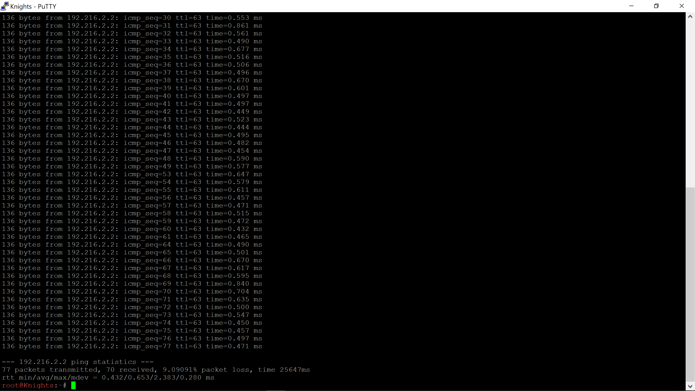
</p>

### Gunakan Filter Wireshark

Gunakan filter `ICMP`, kemudian hasilnya akan ketemu yaitu berapa persen packet loss dan RTT.

<p align="center">
  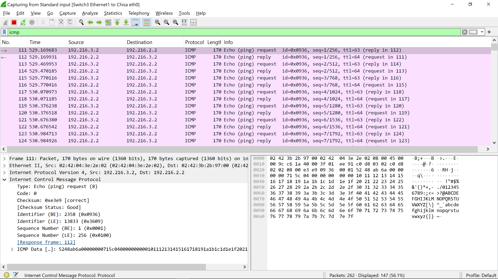
</p>

### Analisis

  1. Hasil `0%` packet loss membuktikan bahwa jalur routing antar-subnet dari node Knights ke node Chisa beroperasi secara optimal tanpa adanya packet dropping.  
  2. Nilai RTT yang terukur pada kisaran sub-milidetik `($\approx 0.23$–$0.30\text{ ms}$)` mengindikasikan latensi jaringan yang sangat rendah pada arsitektur The Wired.

## Soal 11

Buktikan ==kelemahan protokol Telnet== dengan membuat akun ==phantom_user== dan ==password wired_ghost== pada layanan ==telnet di node Chisa.== Lakukan login Telnet dari ==node Eiri ==ke ==node Chisa== dan ==tangkap sesi menggunakan Wireshark.== Tunjukkan kredensial plain text melalui fitur Follow TCP Stream, serta jelaskan mengapa setiap karakter terkirim dalam paket TCP terpisah.

#### Deskripsi Singkat

Praktikan diperintahkan untuk membuat akun/user yang bernama:
- User : `phantom_user`
- Password : `wired_ghost`

Pada layanan telnet node Chisa. Ini untuk menunjukkan ke praktikan seberapa rentan / tidak aman protokol `telnet`.

#### Penjelasan

Protokol `telnet` memiliki kelemahan besar yaitu semua isi sesi dikirim tanpa enkripsi. Jadi yang seharusnya terjadi / dapat dilihat adalah :
- prompt `login:` / `Username:`
- username yang diketik
- prompt `Password:`
- password dalam bentuk karakter biasa (bukan hash)

Selain itu, Telnet secara default bekerja dalam mode *character-at-a-time*. Setiap kali satu tombol ditekan, klien langsung mengirim 1 byte lewat segmen TCP sendiri (biasanya dengan `TCP_NODELAY`), lalu server men-echo karakter itu. Karena itu di packet list Wireshark, username dan password sering terlihat terpecah menjadi banyak paket TELNET kecil. Fitur **Follow TCP Stream** kemudian merakit ulang percakapan itu menjadi teks utuh.

##### Pembuatan User `phantom_user`

Sesuai dengan instruksi, user harus dibuat pada node `Chisa`.

```bash
useradd -m -s /bin/bash phantom_user
passwd phantom_user
```

Password yang diisi: `wired_ghost`.

##### Login Telnet dari Airi ke Chisa

Setelah akun jadi, capture Wireshark dijalankan, lalu dari node Airi dilakukan login Telnet ke Chisa sebagai `phantom_user`. Login berhasil: muncul banner DebiNet, prompt `phantom_user@Chisa`, perintah `whoami` mengembalikan `phantom_user`, lalu sesi ditutup dengan `exit`.

<p align="center">
  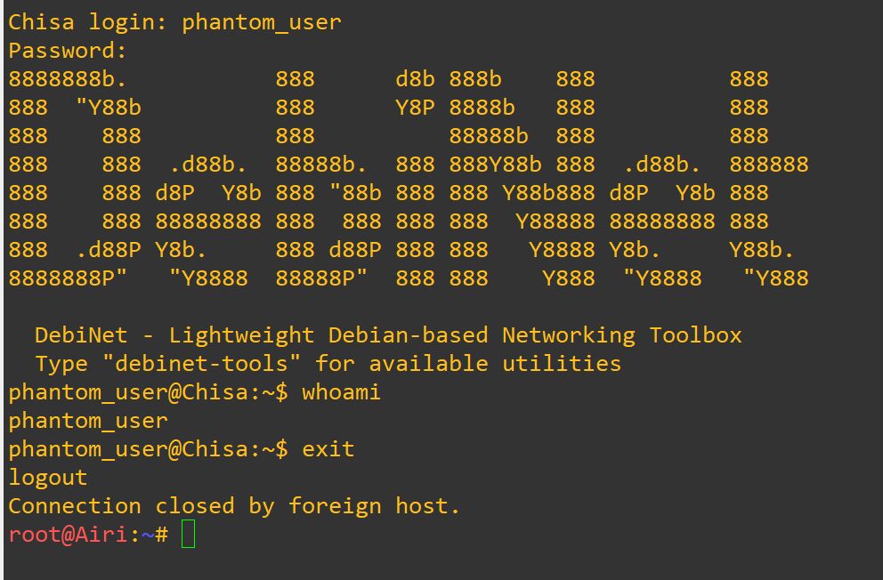
</p>

Gambar di atas adalah bukti bahwa sesi Telnet benar-benar terbentuk. Yang perlu diingat: keberhasilan login justru jadi bahan pembuktian kelemahan, karena seluruh ketikan itu ikut terekam di jaringan.

##### Follow TCP Stream

Jika capture dibuka dan trail paket dengan protocol `TELNET` di-follow (Follow TCP Stream, tampilan Hex Dump), password yang diketik di Airi muncul tanpa enkripsi sama sekali.

<p align="center">
  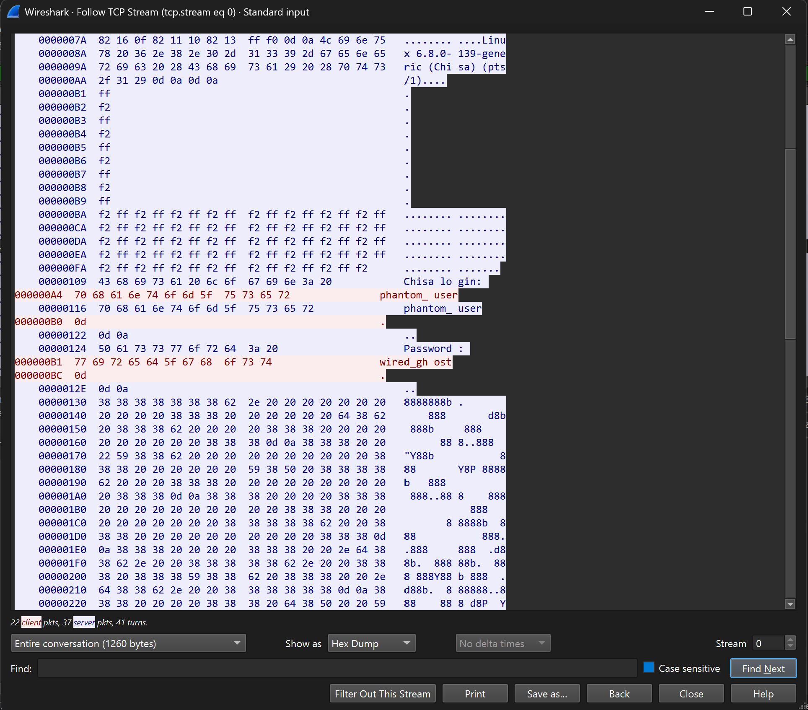
</p>

Yang terlihat di stream:
- server (biru) mengirim banner Linux + prompt `Chisa login:`
- client (merah) mengirim `phantom_user`
- server men-echo username, lalu prompt `Password:`
- client mengirim `wired_ghost` dalam teks biasa

Tidak ada hash, tidak ada TLS. Siapa pun yang berada di jalur yang sama bisa membaca kredensial itu utuh.

### Analisis

Kelemahan Telnet terbukti dari dua sisi. Pertama, Follow TCP Stream menampilkan username `phantom_user` dan password `wired_ghost` sebagai plaintext. Kedua, sifat character-at-a-time membuat setiap ketikan jadi paket TCP terpisah, sehingga keystroke bahkan bisa direkonstruksi per karakter dari packet list. Inilah alasan Telnet tidak layak untuk administrasi jarak jauh, dan kenapa soal berikutnya beralih ke SSH.

## Soal 12

Alice mencurigai Knights menjalankan beberapa layanan rahasia di node-nya. ==Lakukan pemindaian== port ==dari node Alice== ==ke node Knights== menggunakan ==Netcat (nc)== untuk ==memeriksa port 22 (SSH) dan 80 (HTTP)== dalam keadaan terbuka, ==serta port rahasia 7777== dalam keadaan tertutup. Analisis di Wireshark perbedaan TCP Flag yang dikembalikan antara port terbuka (SYN-ACK) dengan port tertutup (RST-ACK).

#### Deskripsi Singkat

Praktikan diminta memindai tiga port di node Knights (`192.216.3.2`) dari node Alice (`192.216.1.2`) memakai `nc`:
- Port `22` (SSH) harus terbuka
- Port `80` (HTTP) harus terbuka
- Port `7777` (port rahasia) harus tertutup

Lalu di Wireshark, bedakan flag TCP yang dikembalikan server: port terbuka menjawab `SYN-ACK`, port tertutup menjawab `RST-ACK`.

#### Penjelasan

Pemindaian ini pada dasarnya adalah TCP handshake yang dipotong. Klien mengirim `SYN` ke port tujuan.
- Jika ada layanan yang listen, server membalas `SYN, ACK` → port terbuka, handshake bisa dilanjutkan.
- Jika tidak ada yang listen, kernel biasanya membalas `RST, ACK` → port tertutup, koneksi langsung ditolak.

Netcat `-zv` hanya mengecek apakah connect berhasil, sedangkan Wireshark yang memperlihatkan flag-nya.

##### Setup layanan di Knights

```bash
apt update
apt install -y openssh-server
mkdir -p /run/sshd
/usr/sbin/sshd
python3 -m http.server 80 &
ss -lntup | grep -E ':22|:80|:7777'
```

Port `22` dan `80` di-listen. Port `7777` sengaja tidak dijalankan apa-apa.

##### Pemindaian dari Alice

```bash
ping -c 2 192.216.3.2
nc -zv 192.216.3.2 22
nc -zv 192.216.3.2 80
nc -zv 192.216.3.2 7777
```

##### Capture Wireshark

Capture diambil pada jalur Alice → Knights. Urutan paketnya langsung memperlihatkan tiga percobaan connect.

<p align="center">
  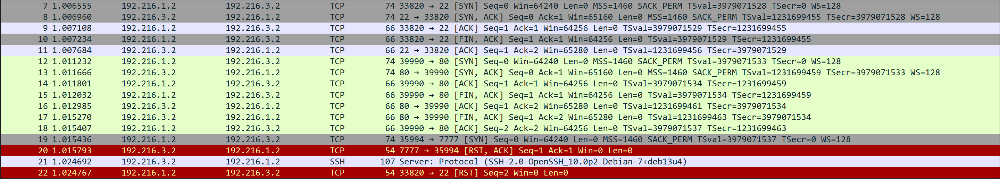
</p>

Yang terlihat di gambar:
- Frame 7–11, port **22**: Alice `SYN` → Knights `SYN, ACK` → Alice `ACK` lalu `FIN, ACK`. Port SSH terbuka. Sempat juga muncul banner `SSH-2.0-OpenSSH_10.0p2`.
- Frame 12–18, port **80**: pola yang sama, Knights membalas `SYN, ACK`. HTTP terbuka.
- Frame 19–20, port **7777**: Alice `SYN`, Knights langsung `RST, ACK` (baris merah). Tidak ada handshake. Port tertutup.

### Analisis

Perbedaan flag-nya jelas. Port terbuka (`22` dan `80`) menjawab `SYN-ACK`, sehingga `nc -zv` menganggap connect berhasil. Port tertutup (`7777`) menjawab `RST-ACK`, koneksi diputus di awal. Inilah cara membedakan open vs closed port dari sisi TCP, tanpa harus menebak dari output Netcat saja.

## Soal 13

Lain memerintahkan agar administrasi jarak jauh ==menggunakan SSH== secara aman tanpa password. ===Install OpenSSH server pada node Knights===, buat pasangan kunci ==SSH (ssh-keygen) ==pada node ==Mika== untuk user ==mika_admin==, dan konfigurasikan public key authentication (PasswordAuthentication no). Lakukan ==koneksi SSH== dari n==ode Mika ke node Knights==, tangkap sesi menggunakan ==Wireshark==, identifikasi paket Protocol Version Exchange dan Key Exchange, serta jelaskan mengapa kredensial tidak terlihat dalam bentuk teks terbuka seperti pada Telnet.

#### Deskripsi Singkat

Praktikan diminta mengganti Telnet dengan SSH:
- Install OpenSSH server di Knights
- Buat user `mika_admin` dan pasangan kunci RSA di node Mika
- Pasang public key di `authorized_keys` Knights
- Matikan login password (`PasswordAuthentication no`)
- Login SSH dari Mika ke Knights, capture Wireshark, tunjukkan Protocol Version Exchange + Key Exchange, dan buktikan kredensial tidak muncul plaintext seperti Telnet

#### Penjelasan

SSH mengenkripsi seluruh sesi setelah key exchange. Yang boleh terlihat di Wireshark hanyalah:
- TCP handshake ke port `22`
- **Protocol Version Exchange** (`SSH-2.0-...`)
- **Key Exchange Init** (algoritma yang ditawarkan)
- Setelah New Keys, sisanya hanya `Encrypted packet`

Password, perintah, dan output shell tidak boleh terbaca. Bandingkan dengan soal 11: di Telnet, `wired_ghost` muncul utuh.

##### Setup user `mika_admin` di Knights

User belum ada, jadi dibuat dulu.

<p align="center">
  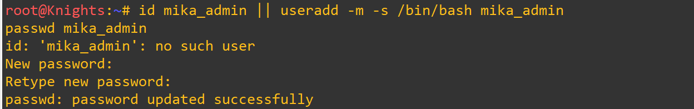
</p>

```bash
id mika_admin || useradd -m -s /bin/bash mika_admin
passwd mika_admin
```

##### Generate kunci di Mika

Di node Mika, sebagai `mika_admin`, dibuat folder `.ssh` dan pasangan kunci RSA 2048-bit tanpa passphrase.

<p align="center">
  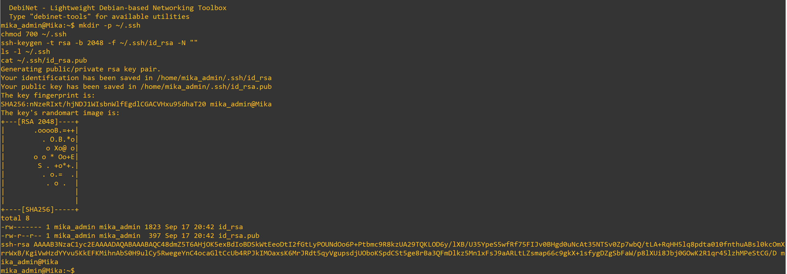
</p>

```bash
mkdir -p ~/.ssh
chmod 700 ~/.ssh
ssh-keygen -t rsa -b 2048 -f ~/.ssh/id_rsa -N ""
ls -l ~/.ssh
cat ~/.ssh/id_rsa.pub
```

Fingerprint dan public key `ssh-rsa AAAA... mika_admin@Mika` yang muncul di gambar itulah yang nanti ditaruh di Knights.

##### Public key authentication di Knights

Public key Mika dimasukkan ke `authorized_keys`, permission dikunci, lalu `sshd_config` diubah agar password login mati.

<p align="center">
  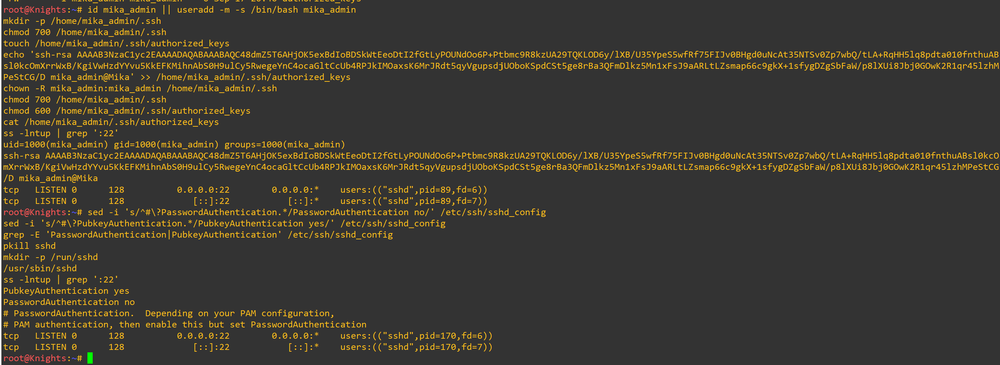
</p>

```bash
mkdir -p /home/mika_admin/.ssh
chmod 700 /home/mika_admin/.ssh
touch /home/mika_admin/.ssh/authorized_keys
# public key dari Mika ditambahkan ke authorized_keys
chown -R mika_admin:mika_admin /home/mika_admin/.ssh
chmod 600 /home/mika_admin/.ssh/authorized_keys

sed -i 's/^#\?PasswordAuthentication.*/PasswordAuthentication no/' /etc/ssh/sshd_config
sed -i 's/^#\?PubkeyAuthentication.*/PubkeyAuthentication yes/' /etc/ssh/sshd_config
grep -E 'PasswordAuthentication|PubkeyAuthentication' /etc/ssh/sshd_config

pkill sshd
mkdir -p /run/sshd
/usr/sbin/sshd
ss -lntup | grep ':22'
```

Hasil grep di gambar: `PubkeyAuthentication yes` dan `PasswordAuthentication no`. `sshd` listen di `0.0.0.0:22`.

##### Capture SSH Mika → Knights

Koneksi dari Mika (`192.216.1.3`) ke Knights (`192.216.3.2:22`) ditangkap Wireshark.

<p align="center">
  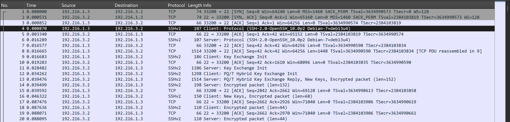
</p>

Urutan yang diminta soal terlihat di packet list:
1. TCP handshake (frame 1–3)
2. **Protocol Version Exchange** client: `SSH-2.0-OpenSSH_10.0p2 Debian-7+deb13u4`
3. **Protocol Version Exchange** server: banner yang sama
4. **Key Exchange Init** (client lalu server)
5. PQ/T Hybrid Key Exchange, New Keys, lalu `Encrypted packet`

Detail Key Exchange Init:

<p align="center">
  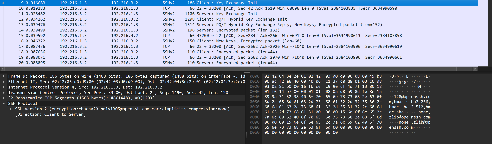
</p>

Paket ini masih bisa dibaca karena belum terenkripsi: klien menawarkan `chacha20-poly1305@openssh.com`, HMAC, dan kompresi. Setelah New Keys, isi sesi tidak lagi plaintext.

<p align="center">
  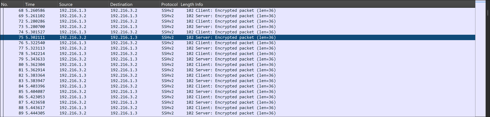
</p>

Gambar terakhir isinya hanya `SSHv2 Encrypted packet (len=36)` bolak-balik. Tidak ada username, tidak ada password, tidak ada perintah. Bandingkan dengan Follow TCP Stream Telnet di soal 11.

### Analisis

SSH berhasil menggantikan Telnet untuk administrasi jarak jauh. Autentikasi memakai kunci `mika_admin`, password login dimatikan. Di Wireshark, yang terbaca hanya Protocol Version Exchange dan Key Exchange; setelah itu seluruh sesi terenkripsi. Kredensial tidak muncul sebagai teks terbuka seperti `wired_ghost` pada Telnet.

## Soal 14

Setelah gagal mengakses FTP, Eiri melancarkan serangan brute-force terhadap form login web Alice. ==Analisis== file capture ==wired_bruteforce.pcapng== untuk mengidentifikasi ==alamat IP penyerang,== ==target IP ==beserta ==port yang diserang==, ==password user lain_admin== yang berhasil ditembus, serta ==web server software ==dan versi yang dilaporkan pada response header. Validasi temuan kalian pada socket server:
([link file](https://drive.google.com/drive/folders/1-MloxOyGauBYglc6TKTQ84VeILvJjjG2?usp=sharing)) nc 10.4.89.247 3401

#### Deskripsi Singkat

Ini soal analisis capture, bukan konfigurasi GNS3. File `wired_bruteforce.pcapng` berisi serangan brute-force ke form login web. Yang harus ditemukan:
- IP penyerang
- IP:port target
- Password user `lain_admin` yang berhasil
- Software/versi web server dari response header

Lalu jawaban divalidasi lewat `nc 10.4.89.247 3401`.

#### Penjelasan

Brute-force di capture ini berupa banyak `POST /login.php` ke port `8080`. Percobaan gagal dapat `401 Unauthorized`. Percobaan yang berhasil dapat `200 OK` plus body `Success! Login successful.` Kredensial ada di body form `username=` dan `password=`, dan identitas server ada di header `Server:`.

##### Mencari pola serangan

Filter HTTP memperlihatkan POST berulang dari `172.26.7.50` ke `172.26.7.100:8080`. Hampir semua dijawab `401`.

<p align="center">
  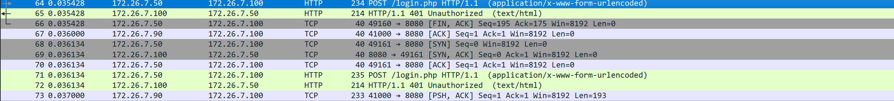
</p>

Detail arah paket: server merespons dari `172.26.7.100:8080` ke klien.

<p align="center">
  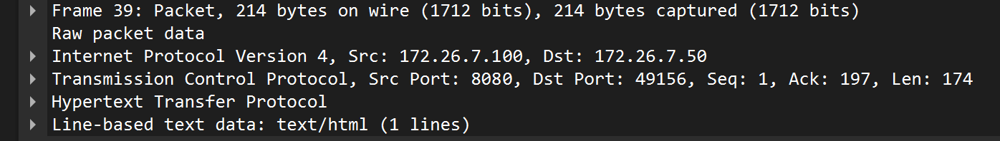
</p>

##### Percobaan yang berhasil

Search string `lain_admin` jatuh di frame 350: `POST /login.php` yang dijawab `200 OK` (bukan 401 lagi).

<p align="center">
  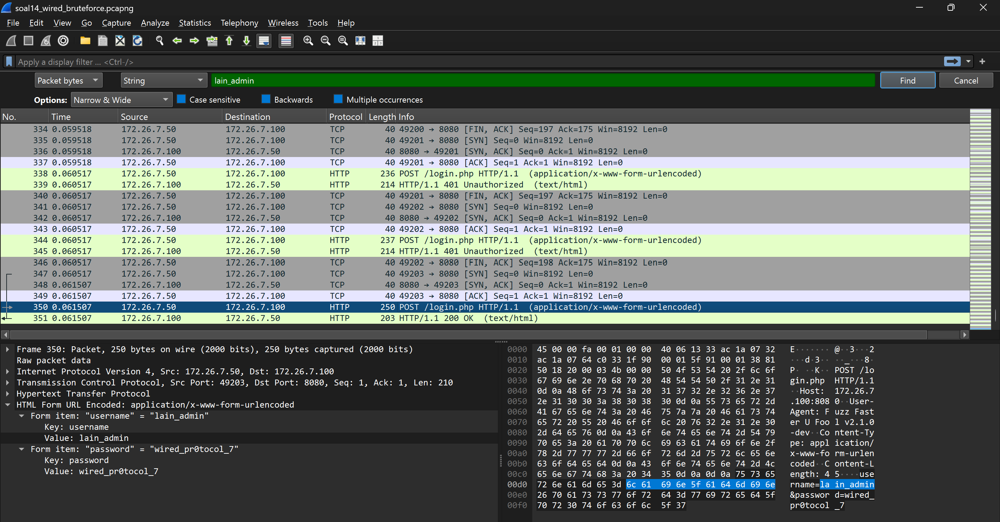
</p>

Form item-nya:

<p align="center">
  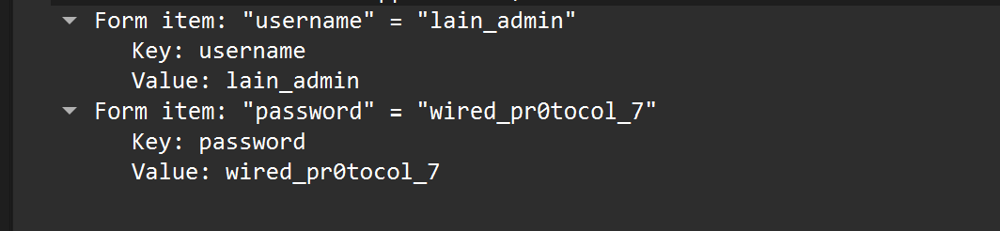
</p>

- username: `lain_admin`
- password: `wired_pr0tocol_7`

##### Header Server

Hex dump response `200 OK` menampilkan `Server: Apache/2.4.62`, `X-Powered-By: PHP/8.3.14`, dan HTML `Success! Login successful.`

<p align="center">
  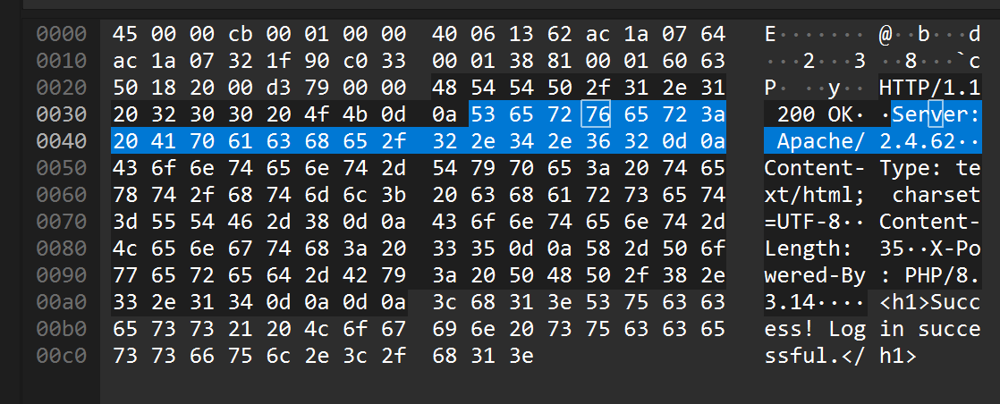
</p>

##### Validasi socket

<p align="center">
  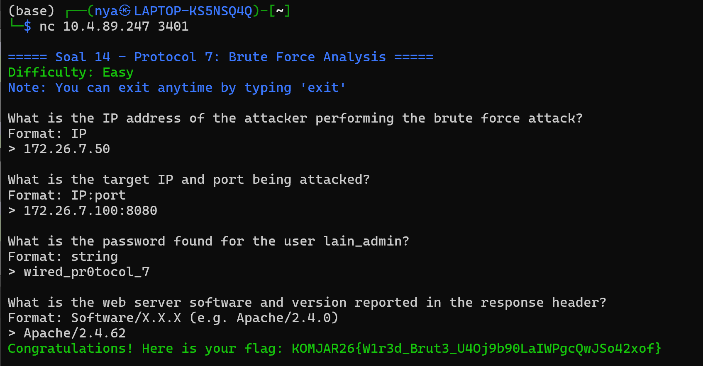
</p>

Jawaban yang diterima:
- Attacker: `172.26.7.50`
- Target: `172.26.7.100:8080`
- Password `lain_admin`: `wired_pr0tocol_7`
- Server: `Apache/2.4.62`

```
KOMJAR26{W1r3d_Brut3_U4Oj9b90LaIWPgcQwJSo42xof}
```

### Analisis

Capture menunjukkan brute-force HTTP form-urlencoded ke `/login.php`. Penyerang `172.26.7.50` menembak `172.26.7.100:8080` sampai dapat `200 OK` dengan password `wired_pr0tocol_7` untuk `lain_admin`. Identitas server terbaca dari header plaintext `Apache/2.4.62`. Sama seperti Telnet dan FTP, HTTP tanpa TLS membocorkan kredensial di jaringan.

## Soal 15

#### Deskripsi Singkat

Soal ini menganalisis capture USB HID keyboard (keylogger di level USB). Yang diminta validator (`nc 10.4.89.247 3402`):
- Vendor ID perangkat
- Product ID perangkat
- USB device address keyboard
- Pesan rahasia yang diketik (hasil decode keystroke)

Judul soalnya: **USB Keystroke Decoding**.

#### Penjelasan

Traffic USB tidak seperti TCP. Identitas alat ada di Device Descriptor (`idVendor`, `idProduct`). Alamat bus ada di field `Device address`. Ketikan sendiri ada di interrupt transfer: 8 byte HID report (`modifier + reserved + keycode`). Keycode itu yang diterjemahkan jadi huruf, termasuk Shift untuk huruf besar / underscore.

##### Device Descriptor

<p align="center">
  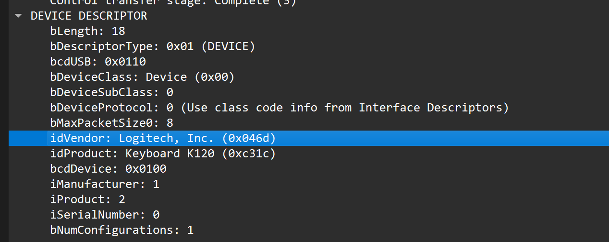
</p>

Descriptor menunjukkan:
- `idVendor: Logitech, Inc. (0x046d)`
- `idProduct: Keyboard K120 (0xc31c)`

Ini keyboard HID, bukan mouse atau storage.

##### String descriptor

<p align="center">
  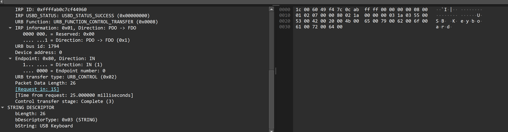
</p>

String descriptor mengonfirmasi `bString: USB Keyboard`. Di sisi kanan hex dump, UTF-16LE `S.B. Keyboard` terbaca sebagai `USB Keyboard`.

##### Device address dan HID report

<p align="center">
  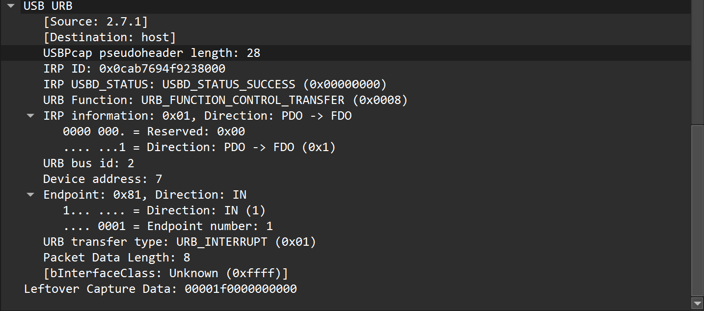
</p>

- `Device address: 7`
- Endpoint IN `0x81`, transfer type interrupt
- `Leftover Capture Data: 00001f0000000000` → HID report 8 byte (satu keystroke)

Contoh report lain:

<p align="center">
  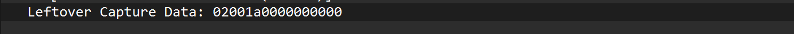
</p>

`02001a0000000000` artinya modifier Shift (`02`) + keycode `0x1a`. Setiap paket interrupt seperti ini dirangkai jadi string.

Hasil decode seluruh keystroke: `Wired_Protocol_7_is_alive_2026`.

##### Validasi socket

<p align="center">
  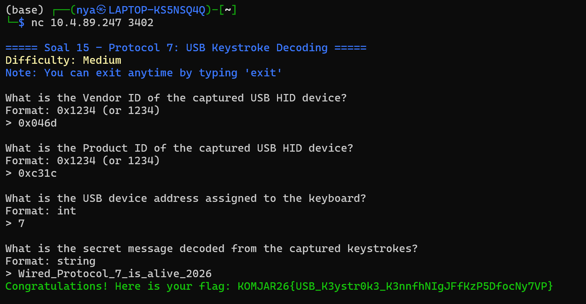
</p>

Jawaban yang diterima:
- Vendor ID: `0x046d`
- Product ID: `0xc31c`
- Device address: `7`
- Pesan: `Wired_Protocol_7_is_alive_2026`

```
KOMJAR26{USB_K3ystr0k3_K3nnfhNIgJFfKzP5DfocNy7VP}
```

### Analisis

Capture USB membuktikan keyboard Logitech K120 (VID `0x046d`, PID `0xc31c`) di address `7` merekam ketikan sebagai HID report. Karena report itu tidak terenkripsi, pesan `Wired_Protocol_7_is_alive_2026` bisa disusun ulang dari leftover capture data. Ini analog dengan Telnet: input user bocor di jalur yang ditangkap.

## Soal 16

#### Deskripsi Singkat

Analisis capture FTP yang dipakai menyerang / mengunduh malware. Validator (`nc 10.4.89.247 3403`) menanyakan:
- IP FTP server tempat malware diunduh
- Banner software FTP
- Kredensial login (user:pass)
- Ukuran file `knights_payload.exe` dalam byte

Judul soalnya: **FTP Credential Theft**.

#### Penjelasan

FTP kontrol di port `21` juga plaintext, sama seperti Telnet. Banner `220`, perintah `USER` / `PASS`, dan `SIZE` semuanya terbaca di packet list. Tidak perlu Follow Stream pun sudah kelihatan.

##### Banner server

<p align="center">
  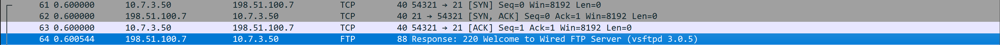
</p>

Klien `10.7.3.50` connect ke `198.51.100.7:21`. Server menjawab:

`220 Welcome to Wired FTP Server (vsftpd 3.0.5)`

Banner yang diminta validator adalah nama software + versinya: `vsftpd 3.0.5` (bukan seluruh baris 220). Beberapa format lain ditolak.

##### Kredensial

<p align="center">
  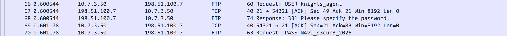
</p>

- `USER knights_agent`
- `PASS N4v1_s3cur3_2026`

Password dikirim teks biasa setelah `331 Please specify the password.`

##### Ukuran malware

<p align="center">
  
</p>

`SIZE knights_payload.exe` dijawab `213 524288` → ukuran file **524288** byte.

##### Validasi socket

<p align="center">
  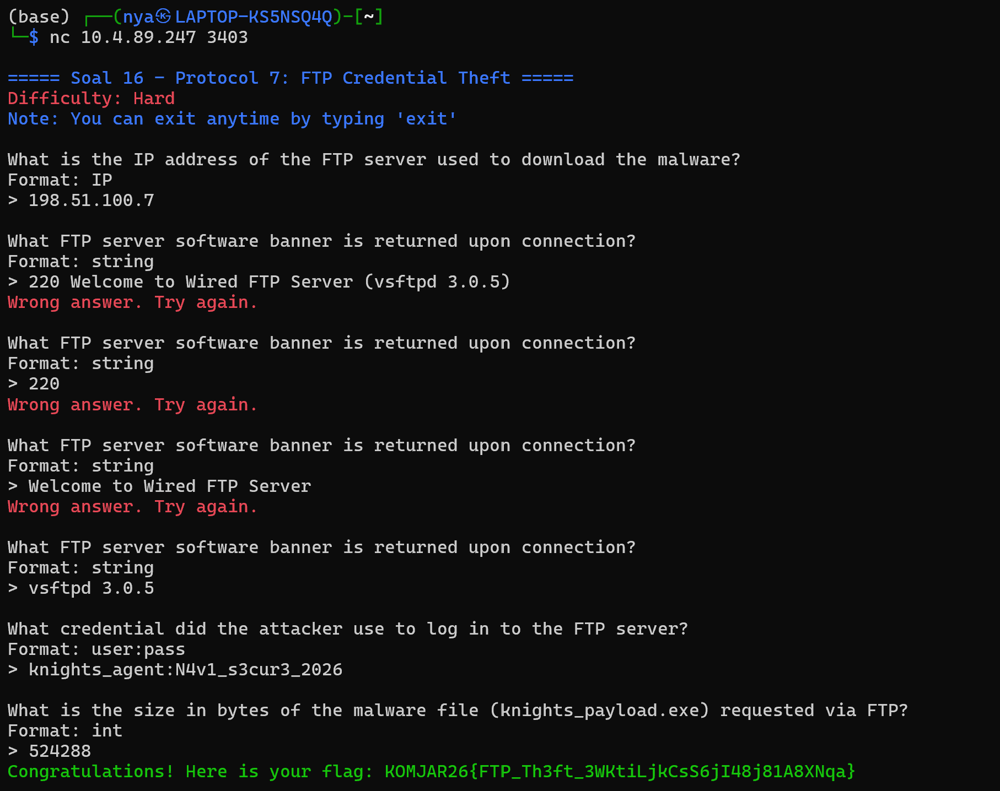
</p>

Jawaban yang diterima:
- FTP server: `198.51.100.7`
- Banner: `vsftpd 3.0.5`
- Credential: `knights_agent:N4v1_s3cur3_2026`
- Size: `524288`

```
KOMJAR26{FTP_Th3ft_3WKtiLjkCsS6jI48j81A8XNqa}
```

### Analisis

Sesi FTP membocorkan semuanya: alamat server, banner `vsftpd 3.0.5`, akun `knights_agent` / `N4v1_s3cur3_2026`, dan ukuran payload `knights_payload.exe` (524288 byte). Ini kelanjutan langsung dari kelemahan plaintext yang sudah ditunjukkan di Telnet.

## Soal 17

#### Deskripsi Singkat

Analisis capture DNS + HTTP untuk unduhan malware C2. Validator (`nc 10.4.89.247 3404`) menanyakan:
- Domain (Host) tempat file mencurigakan diunduh
- IP web server
- Nama file executable
- HTTP status code saat file itu diunduh

Judul soalnya: **HTTP Malware Retrieval**.

#### Penjelasan

Alurnya klasik: host resolve nama dulu (DNS), baru HTTP GET. Domain yang berhasil di-resolve itulah C2. File malware terlihat di path HTTP, status `200` artinya unduhan sukses.

##### DNS

<p align="center">
  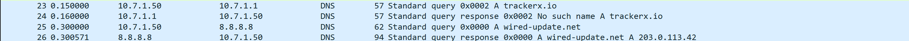
</p>

Host `10.7.1.50` sempat query `trackerx.io` (gagal, *No such name*), lalu query `wired-update.net` ke `8.8.8.8`. Jawaban: **A `203.0.113.42`**.

##### HTTP GET payload

<p align="center">
  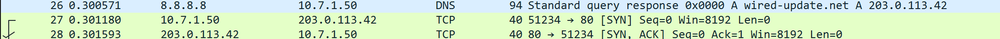
</p>

<p align="center">
  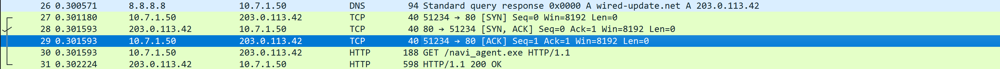
</p>

Setelah handshake ke `203.0.113.42:80`:
- `GET /navi_agent.exe HTTP/1.1`
- response `HTTP/1.1 200 OK`

##### Validasi socket

<p align="center">
  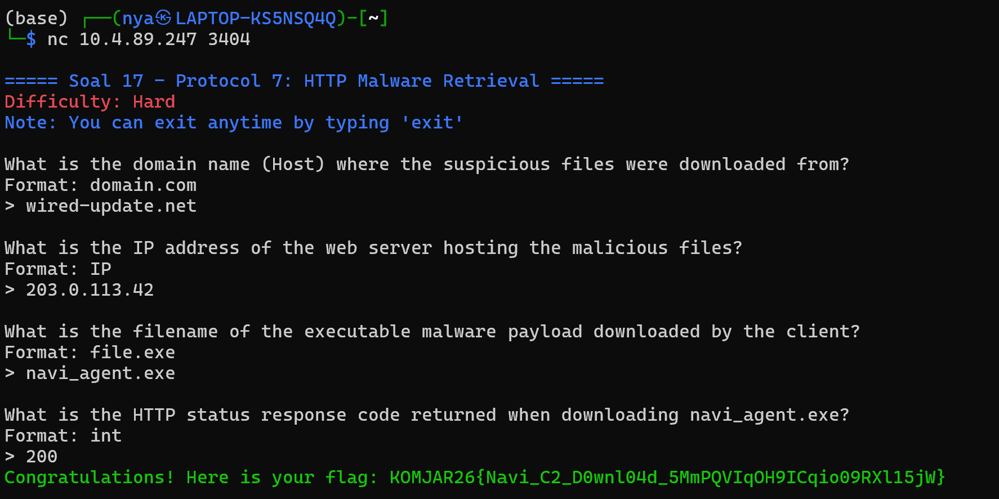
</p>

Jawaban yang diterima:
- Domain: `wired-update.net`
- IP server: `203.0.113.42`
- File: `navi_agent.exe`
- Status: `200`

```
KOMJAR26{Navi_C2_D0wnl04d_5MmPQVIqOH9ICqio09RXl15jW}
```

### Analisis

Host korban me-resolve `wired-update.net` ke `203.0.113.42`, lalu mengunduh `navi_agent.exe` lewat HTTP dan dapat `200 OK`. DNS memberi nama C2, HTTP memberi file-nya. Keduanya plaintext, jadi rantai unduhan malware terbaca utuh di Wireshark.

## Soal 18

#### Deskripsi Singkat

Analisis capture SMB2 untuk *lateral transfer* malware ke mesin korban. Validator (`nc 10.4.89.247 3405`) menanyakan:
- Protokol file sharing yang dipakai
- IP sumber (yang mengirim malware)
- IP korban (yang menerima)
- Share / direktori tujuan
- Nama file executable

Judul soalnya: **SMB Lateral Transfer**.

#### Penjelasan

SMB2 dipakai Windows untuk berbagi berkas. Di capture, `Create Request` membuka file di share, `Write Request` menulis isinya, `Close Request` menutup handle. Tree/`ADMIN$` merujuk ke direktori sistem korban; path file-nya `System32\...`.

##### Share tujuan

<p align="center">
  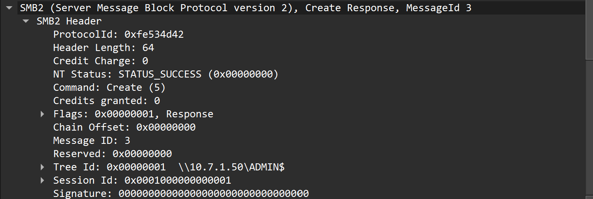
</p>

Tree Id mengarah ke `\\10.7.1.50\ADMIN$`. `ADMIN$` adalah admin share yang memetakan ke Windows system directory.

##### File yang ditulis

<p align="center">
  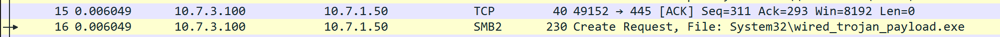
</p>

`10.7.3.100` → `10.7.1.50:445` : `Create Request, File: System32\wired_trojan_payload.exe`

<p align="center">
  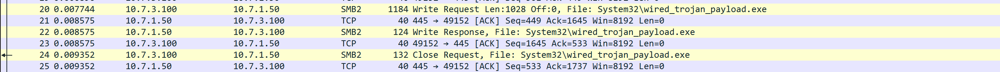
</p>

Lanjut `Write Request` lalu `Close Request` pada file yang sama. Transfer selesai.

##### Validasi socket

<p align="center">
  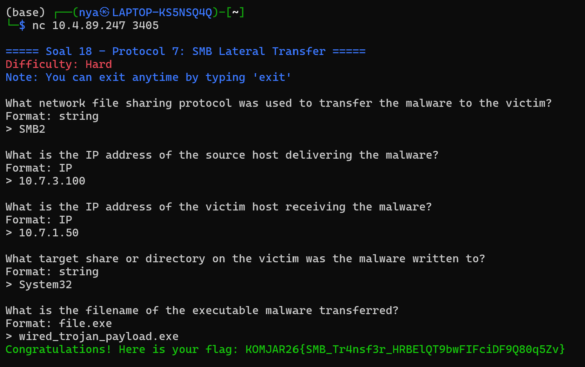
</p>

Jawaban yang diterima:
- Protokol: `SMB2`
- Sumber: `10.7.3.100`
- Korban: `10.7.1.50`
- Direktori: `System32`
- File: `wired_trojan_payload.exe`

```
KOMJAR26{SMB_Tr4nsf3r_HRBElQT9bwFIFciDF9Q80q5Zv}
```

### Analisis

Malware dipindah secara lateral lewat SMB2: host `10.7.3.100` menulis `wired_trojan_payload.exe` ke `System32` di korban `10.7.1.50` (lewat share `ADMIN$`). Create → Write → Close adalah jejak transfer yang diminta soal.

## Soal 19

#### Deskripsi Singkat

Analisis email SMTP/EML pemerasan. Validator (`nc 10.4.89.247 3406`) menanyakan:
- Email korban
- Password yang diklaim dicuri
- Jenis malware yang diklaim
- Deadline pembayaran (hari)
- `MailClientID` di akhir email

Judul soalnya: **SMTP Threat Inspection**.

#### Penjelasan

Wireshark bisa mengekspor objek email. Isi EML adalah teks biasa: From, To, Subject, body, plus ID klien di footer. Ancaman, password, dan permintaan tebusan ada di body, bukan di header protokol.

##### Daftar objek email

<p align="center">
  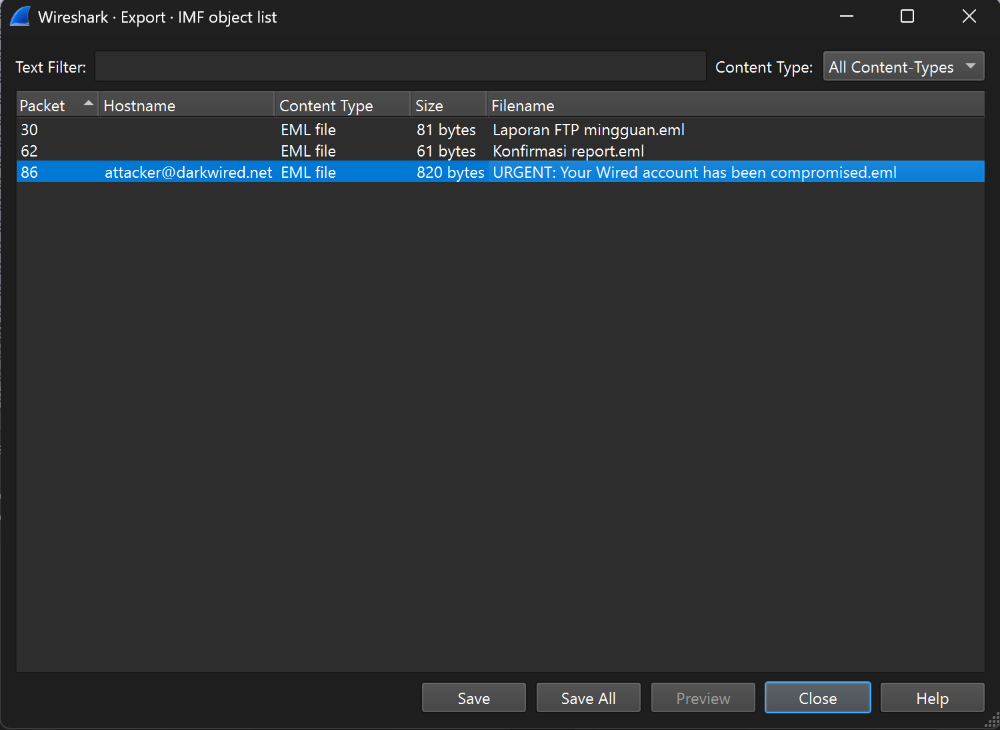
</p>

Ada tiga EML. Yang relevan pemerasan: packet 86, From `attacker@darkwired.net`, file `URGENT: Your Wired account has been compromised.eml` (820 bytes). Dua lainnya (`Laporan FTP mingguan.eml`, `Konfirmasi report.eml`) tampak email biasa.

##### Isi email pemerasan

<p align="center">
  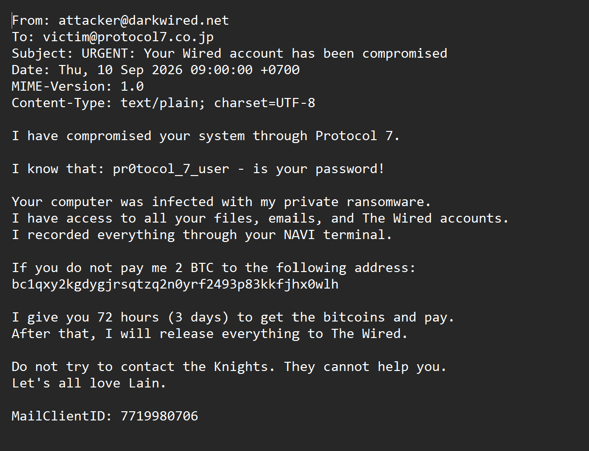
</p>

Isi yang dipakai menjawab:
- From: `attacker@darkwired.net`
- To: `victim@protocol7.co.jp`
- Password yang diklaim: `pr0tocol_7_user`
- Malware: `ransomware`
- Deadline: `72 hours (3 days)`
- `MailClientID: 7719980706`

##### Validasi socket

<p align="center">
  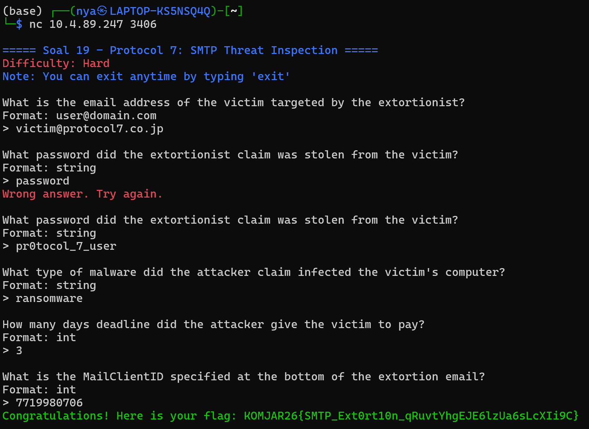
</p>

Jawaban yang diterima:
- Victim: `victim@protocol7.co.jp`
- Password: `pr0tocol_7_user`
- Malware: `ransomware`
- Deadline: `3`
- MailClientID: `7719980706`

```
KOMJAR26{SMTP_Ext0rt10n_qRuvtYhgEJE6lzUa6sLcXIi9C}
```

### Analisis

Email pemerasan dikirim ke `victim@protocol7.co.jp`, mengklaim password `pr0tocol_7_user` dan infeksi ransomware, dengan tenggat 3 hari. `MailClientID 7719980706` ada di footer. SMTP/IMF di capture ini tidak terenkripsi, jadi seluruh ancaman terbaca setelah objek EML diekspor.

## Soal 20

#### Deskripsi Singkat

Soal terakhir menganalisis sesi HTTPS yang sudah bisa didekripsi (ada key log). Validator (`nc 10.4.89.247 3407`) menanyakan:
- Versi TLS yang dinegosiasikan
- Domain SNI / Host
- IP server HTTPS
- User-Agent klien
- Method + path HTTP setelah dekripsi

Judul soalnya: **TLS Decrypted Stream**.

#### Penjelasan

Tanpa kunci, HTTPS hanya terlihat sebagai TLS handshake + Application Data. File `keyslogfile.txt` adalah SSLKEYLOGFILE (pre-master secret). Wireshark memakai file itu untuk mendekripsi `wired_tls_decrypt.pcapng`, sehingga SNI, HTTP method, dan User-Agent jadi terbaca.

##### Berkas yang dipakai

<p align="center">
  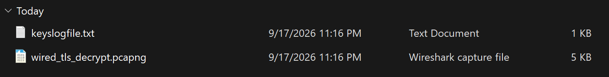
</p>

Dua file ini dipasangkan: pcap berisi sesi terenkripsi, `keyslogfile.txt` berisi kunci untuk (Pre)-Master-Secret log di Wireshark (`Edit → Preferences → Protocols → TLS → (Pre)-Master-Secret log filename`).

Setelah didekripsi, yang diperoleh:
- Versi: `TLSv1.2`
- SNI / Host: `example.com`
- IP HTTPS: `93.184.216.34`
- User-Agent: `curl/7.62.0`
- Request: `HEAD /`

##### Validasi socket

<p align="center">
  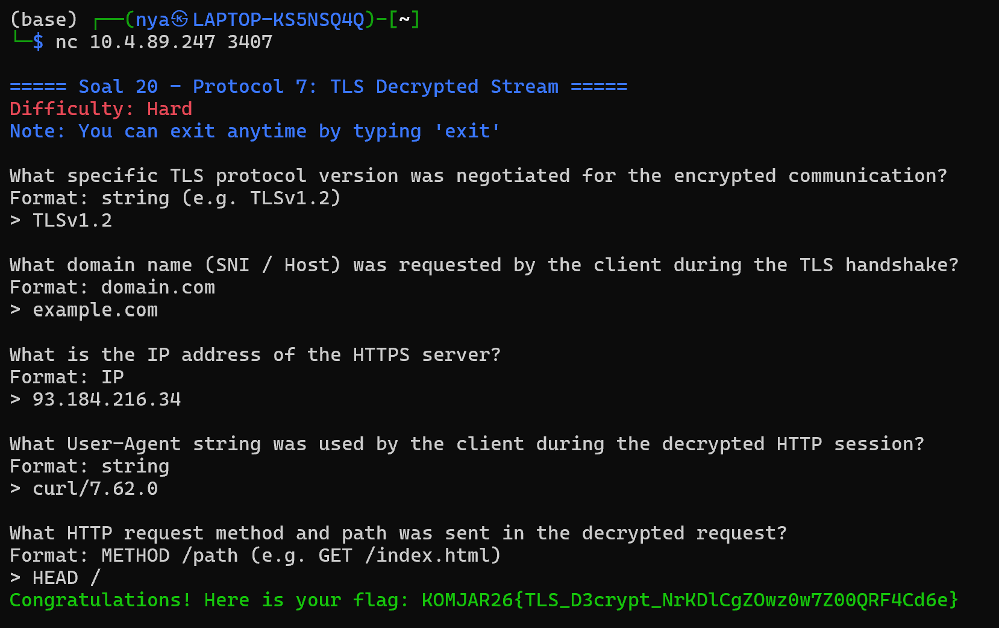
</p>

Jawaban yang diterima:
- TLS: `TLSv1.2`
- SNI: `example.com`
- IP: `93.184.216.34`
- User-Agent: `curl/7.62.0`
- Request: `HEAD /`

```
KOMJAR26{TLS_D3crypt_NrKDlCgZOwz0w7Z00QRF4Cd6e}
```

### Analisis

Berbeda dengan Telnet/FTP/HTTP biasa, isi sesi ini baru terbaca setelah key log dipakai. Handshake menegosiasikan `TLSv1.2` ke `example.com` (`93.184.216.34`). Setelah dekripsi, request-nya `HEAD /` dengan User-Agent `curl/7.62.0`. Ini menutup rangkaian soal: protokol plaintext bocor sendiri, TLS tidak — kecuali kuncinya ikut tertangkap.

# Revisian

## Soal 7
Jadi untuk nomor 7 ini tadi kendalanya ftp servernya hilang dan disini saya melakukan install ulang. Jadi setelah saya install ulang langsung saya lakukan uji coba untuk ketentuan dari nomor 7 yaitu untuk `alice` bisa write and read, akan tetapi untuk `eiri` gagal untuk login ke ftp servernya. Dibawah ini hasil dari uji coba saya

<p align="center">
  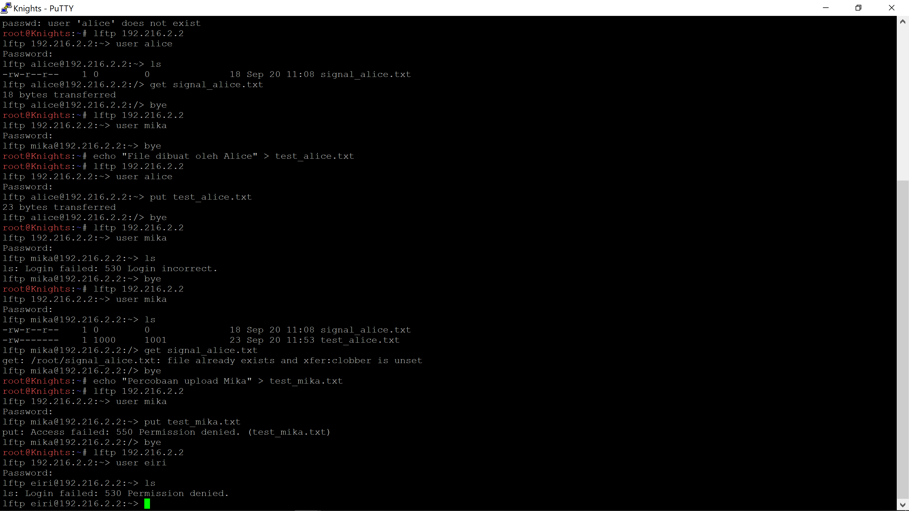
</p>

## Soal 8
Untuk soal nomor 8 ini saya hanya melanjutkan karena tadi saat demo tidak saaya jelaskan karena terkendala pada nomor 7. dan sekarang untuk nomor 8 sudah berhasil untuk STOR, PASV dan 226

<p align="center">
  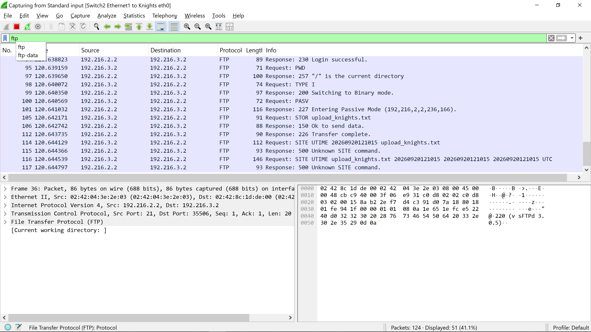
</p>

## Soal 9
Untuk soal nomor 9 ini hanya disuruh buat membuktikan bahwa mika hanya bisa read only dan tidak bisa upload file. Nomor ini masuk ke dalam revisi karena tadi saat demo saya tidak sempat menjelaskan karena masih terkendala pada nomor 7 yaitu FTP servernya hilang dan harus di install ulang. Dibawah ini merupakan hasil dari pengujian mika yang tidak bisa upload file

<p align="center">
  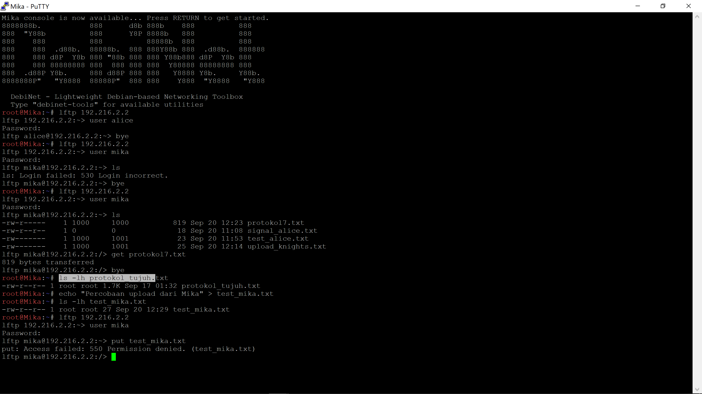
</p>
## Soal 11

Running the command i've prepaared again, we can see that it somehow works again (???)
![[WhatsApp Image 2026-09-20 at 22.01.53.jpeg]]

dan bisa juga login ke user itu 
![[WhatsApp Image 2026-09-20 at 22.03.46.jpeg]]
## Soal 12

sama seperti soal 13, python3 tiga (somehow) uninstalled itself from Knights
![[Pasted image 20260920230801.png]]

setelah install ulang : 
![[Pasted image 20260920230820.png]]

Kita buka port 22,80, tetapi bukan 7777

Dan jika test alice 
![[Pasted image 20260920230912.png]]
boom terbukti yay ke closed 7777, hidup jarkom
## Soal 13
Revisi disini muncul karena config openssh dan even openssh sendiri tidak terinstall....
anyways....
### Install ulang openssh
![[Pasted image 20260920222417.png]]

### sshd mati, config ulang dan tambahkan user `mika_admin`

![[Pasted image 20260920222438.png]]

![[Screenshot 2026-09-20 222850 1.png]]
### membuat pasangan kunci
![[Screenshot 2026-09-20 223158.png]]

### pasang public key `Mika` di `Knights`
![[Screenshot 2026-09-20 223409.png]]

### Rapikan permission dan password
![[Screenshot 2026-09-20 223621.png]]

### Tulis ulang kunci satu baris
![[Screenshot 2026-09-20 223713.png]]

### SSH berhasil, masih pakai password![[Screenshot 2026-09-20 223828 1.png]]

### tutup sesi
![[Screenshot 2026-09-20 223908.png]]

### ganti kunci ke ed25519 di `Mika`

![[Screenshot 2026-09-20 224015.png]]

### Pasang public key ed25519 di Knights
![[Screenshot 2026-09-20 224112.png]]

### Login tanpa password
![[Screenshot 2026-09-20 224056.png]]

### Matikan login password
![[Screenshot 2026-09-20 224225.png]]

### Veri(ty)fikasi
![[Screenshot 2026-09-20 224256.png]]